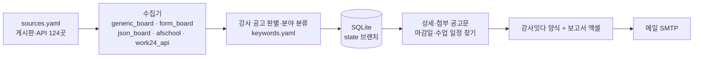

# 부산 공공기관 강사 구인공고 일일 수집·메일 발송 설계

> 상태: 1~3단계 구현 (v0.1, 2026-09-29) — 실제 동작·설정 방법은 [README](../README.md)
> 목표: 부산 지역 공공기관(교육청·학교, 지자체, 공단 체육시설, 평생학습·도서관, 청소년·여성 기관, 시 출연기관, 국가·공공기관)의
> **강사 구인공고를 매일 자동 수집**해서 **강사잇다 공고 올리기 양식(엑셀)으로 정리한 뒤 이메일로 받기**.
>
> 코드는 운영 중인 울산판([ulsan-shcool-public-company](https://github.com/thskal17-sudo/ulsan-shcool-public-company))을
> 그대로 가져와 부산용으로 바꿨다. 울산판의 설계 배경(수집 전략, 신규 판정, 첨부 공고문 읽기, 강사잇다 양식, catch-up 등)은
> 울산판 docs/DESIGN.md 에 자세히 있고, 이 문서는 부산판에서 정한 것과 바뀐 것을 적는다.

---

## 1. 요구사항

| 구분 | 내용 |
|---|---|
| 대상 지역 | 부산광역시 전역 (15개 구 + 기장군) |
| 대상 기관 | 부산교육청(본청·5개 교육지원청·늘봄지원센터·학교), 부산시청·16개 구·군청, 공단·체육시설, 구립 평생학습관·도서관, 청소년·여성 기관, 시 출자·출연기관, 부산 소재 국가·공공기관 |
| 제외 | 대학 부설 평생교육원 (다른 저장소 lifelong-education-pyengsang- 가 담당), 울산판의 캠프 수주(나라장터) 기능 |
| 결과물 | 강사잇다 공고 올리기 양식(.xlsx) 첨부 메일, 매일 1회 (+ 접속 안 된 사이트 보충 메일) |
| 메일 | 제목 `[부산 강사구인] 9/30(수) 신규 N건 · 마감임박 N건`, 첨부 `강사잇다_부산_날짜.xlsx`, 지역 칸 `부산 + 구·군` |

## 2. 전체 구조 (울산판과 같음)

수집기는 울산판 것을 모두 유지한다. 부산 게시판은 대부분 `generic_board`(표·목록 게시판)로 읽고, 잡알리오는 `form_board`,
고용24는 `work24_api` 를 쓴다. `json_board`(AJAX 목록)와 `afschool`(울산 방과후학교 온라인지원시스템 형식)은 지금 부산 소스에는
쓰지 않지만 같은 형식의 게시판이 생기면 쓸 수 있게 남겨 두었다.

- `python -m busan_jobs run` 한 번이 수집 → 판별 → 저장(신규·중복 판정) → 공고문 읽기 → 엑셀 → 메일을 한다.
- GitHub Actions `daily.yml`: `collect` 작업 뒤, 접속불가·시간초과 소스가 있으면 `catch-up` 작업이 새 러너에서 그 소스만 다시 수집하고
  새 공고가 있을 때만 보충 메일을 보낸다.
- 수집 기록은 `state` 브랜치에 `postings.db` 하나로 덮어써 저장한다 (`scripts/state_db.sh`).

## 3. 울산판에서 바꾼 것

| 영역 | 바꾼 내용 |
|---|---|
| 패키지·문구 | `ulsan_jobs` → `busan_jobs`. 메일 제목·본문, 첨부 파일명(`강사잇다_부산_…`), 보고서(`부산_강사구인_…`), User-Agent |
| 구·군 판별 | 부산 16개 구·군. 글자로 찾으므로 `강서구` 를 `서구` 보다 먼저 본다 |
| 고용24 | 지역 코드 `26000` (부산) |
| 잡알리오 | 근무지 코드 `R3014` (부산광역시, 검색 폼에서 확인) |
| 예약 시각 | 매일 06:37 KST (`37 21 * * *`). 무료 예약 실행은 정각 무렵에 몰려 몇 시간씩 밀리기도 해서 정각·30분을 피하고, 울산판(07:00)·캠프(07:40)와 겹치지 않게 |
| 캠프 수주 | `camp.py`, `camp.yml`, `config/camp.yaml` 는 가져오지 않음 |

### 3.1 새로 넣은 수집기 옵션 (부산 게시판 모양 때문)

| 옵션 | 쓰는 곳 | 까닭 |
|---|---|---|
| `link_attr` | 부산교육청·교육지원청·늘봄지원센터·시민도서관(`data-id`), 연제구 평생학습(`data-action`) | 제목 링크가 `href="javascript:"` 이고 글 번호는 속성에만 있음 |
| `row_selector` + `title_selector`·`date_selector`·`org_selector` | 부산일자리정보망, 부산문화재단 | 표가 아닌 `<ul><li>` 목록이고 링크 안에 날짜·기관이 섞여 있음 |
| `org_prefix` | 구청 새올, 시청 게시판 | 기관 칸이 담당 부서(`체육진흥과`)라서 `부산 서구청 체육진흥과` 처럼 기관 이름을 붙임 |
| `include` | 체육시설관리사업소 공지 | '수영강습 접수 안내' 같은 이용자 공지가 '강습'으로 걸려서 이 게시판만 `강사·지도자·코치·트레이너` 로 좁힘 |
| `short_headers` | 남구·사상구 새올 | 첫 진단에서 `400 Bad Request (Request header field is missing ':' separator. o;q=0.9)` — 서버가 머리글 줄을 중간에서 자름. Accept-Language 를 빼면 됐고, 다음 진단에서는 기본 머리글도 돼서 간헐적인 것으로 보고 그 호스트만 빼고 보냄 |
| (자동) 칸 onclick 행 | 영도구 새올 | 옛 화면은 제목에 링크가 없고 `<td onclick="searchDetail('번호')">`, 머리글도 td |
| (자동) 숨은 머리글 | 부산교육청 계열 | 칸마다 모바일용 `<em class="mTit">작성자</em>` 가 들어 있어 값 앞에서 뺌 |
| (자동) 작성자 → 기관명 | 부산교육청 계열 | 작성자 칸이 담당 교사 이름(`최희상`)이거나 `ou=가람중학교` → 사람 이름이면 제목 속 학교 이름 |
| (자동) 검색 기간 파라미터 | 부산시청 계열 | 상세 링크에 오늘 날짜로 바뀌는 `srchBeginDt`·`srchEndDt` 가 붙음 → 글 식별값에서 뺌 (안 빼면 매일 신규) |

### 3.2 여러 게시판에 올라온 같은 공고 (중복 판정)

부산은 한 공고가 여러 게시판에 동시에 올라오는 경우가 많다.

- 부산교육청 **학교인력채용**(본청) ↔ 관할 **교육지원청 학교인력채용**: 학교가 올린 글이 양쪽에 보인다
  (본청은 하루 10~20건이라 3쪽만 보고, 교육지원청은 조금 더 오래된 글까지 보인다)
- **구청 새올 채용공고** ↔ **부산일자리정보망 공공채용**·**부산시청 통합 채용정보**

새 공고를 저장할 때 다른 게시판에 먼저 저장된 공고와 **제목(글자·숫자만)이 같고, 게시일이 7일 안이며, 구가 맞으면**
(한쪽이 '부산전체'면 맞는 것으로 봄) `중복` 상태로 저장해 신규·진행중·강사잇다 양식에서 뺀다. 제목이 12자보다 짧으면
('시간강사 채용 공고') 기관이 달라도 같을 수 있어 비교하지 않는다. 같은 실행에서는 `sources.yaml` 순서대로 먼저 본 게시판이 남는다
(교육청 본청 → 교육지원청, 새올 → 부산일자리정보망). `중복`·`결과발표` 상태는 다음 날 목록에 글이 그대로 있어도 되돌리지 않는다.

### 3.3 판별 규칙 추가 (`keywords.yaml`)

| 추가 | 까닭 (부산 게시판에서 본 글) |
|---|---|
| 제외 `자원봉사` | '명지유치원 특수교육대상유아 방과후과정 지원 자원봉사자 모집' ('방과후'로 걸림) |
| 제외 `실무사`·`실무원` | '늘봄실무사 인력 채용', '교무행정실무원' (교육공무직, 강사 아님) |
| 제외 `나는 강사다`·`나도 강사다`·`경연대회` | 평생학습주간 '주민강사 경연대회 참가자 모집' |
| 결과공고 `채용 완료`·`모집 완료`·`공고 완료` | 동래구국민체육센터 '시간강사 채용 공고 완료' |

## 4. 게시판 조사 (2026-09-29, GitHub 러너 미국 버지니아)

이 작업 환경에서는 한국 공공기관 사이트에 직접 접속할 수 없어서, 울산판처럼 GitHub Actions 러너에서 받아 확인했다.
① 기관 첫 화면을 받아 메뉴에서 채용·공지 게시판 주소를 찾고 ② 게시판 목록을 게시판 파서로 읽어 보고
③ 상세 페이지·첨부 공고문까지 읽는 전체 시험 수집(`run --no-mail`)을 돌렸다. 게시판 주소 후보는 웹 검색으로도 모았다.

### 4.1 사이트 유형

| 유형 | 사이트 | 처리 |
|---|---|---|
| 부산교육청 게시판(na/ntt) | 본청·교육지원청·늘봄지원센터·시립도서관 (`selectNttList.do?mi=&bbsId=`) | 목록 GET, 쪽은 `currPage`, 상세 `selectNttInfo.do?…&nttSn=` GET 가능. 상세 본문에 '접수기간' 이 있어 마감일·수업 일정·접수 이메일을 찾음. 첨부는 문서 뷰어(스크립트)라 내려받지 않음 |
| 새올(eminwon) 채용공고 | 11개 구청 | 울산판과 같은 목록 주소(`not_ancmt_se_code=05`). 상세 `selectOfrNotAncmt` GET |
| 부산시청 CMS | 시청 통합 채용정보·타기관 채용정보, 체육시설관리사업소·금련산청소년수련원·여성회관 (`/depart/jobgonji01` 등) | 표 게시판, 상세 `/{게시판}/{번호}`. 링크의 검색 기간 파라미터는 식별값에서 뺌 |
| 구청 홈페이지 CMS | 구청 일자리·평생학습관 (`board/list.{구}?boardId=BBS_…`) | 표 게시판, 글 번호 `dataSid` |
| 전자정부형·JS 링크 | 남구시설관리공단(`fn_go_view`), 사하구 평생학습(`boardView`) | `link_template` 으로 GET 주소 조립 |
| `<li>` 목록 | 부산일자리정보망, 부산문화재단 (`show('번호')` → 같은 GET 폼) | `row_selector`·`title_selector` 등 |

### 4.2 전체 시험 수집 (2026-09-29, 메일 없이)

| 항목 | 결과 |
|---|---|
| 소스 | 사용 57곳 모두 '정상' (고용24는 인증키가 없어 '설정필요') |
| 걸린 시간 | 약 4분 (상세·첨부 공고문 읽기 포함) |
| 강사 공고 | 74건 저장 → 마감 전 신규 19건 (늘봄 개인위탁 등 9월 초 공고는 이미 마감) |
| 중복으로 뺀 공고 | 4건 (교육청 본청 ↔ 남부·북부교육지원청, 새올 ↔ 부산일자리정보망, 동구청 채용공고 ↔ 동구 새올) |
| 결과공고로 닫은 공고 | 1건 |
| 마감일 | 마감 전 19건 중 15건에서 찾음 (4건은 강사잇다 양식에서 '보류') |
| 공고문에서 찾은 칸 (19건) | 수업 일정 8 · 모집 인원 6 · 지원 이메일 5 · 지원 자격 3 · 제출 서류 2 · 수업 대상 1 |

조사 중 한 번씩 동구청 3개 게시판이 0건(방화벽 화면으로 보임), 남구·사상구 새올이 400 을 돌려줬지만 다음 진단에서는 정상이었다.

### 4.3 추가 조사 (2026-09-29 오후): 북구·강서구·수영구, 여성인력개발센터, 청소년수련관·문화의집·상담복지센터·꿈드림, 지역아동센터, 복지관

| 구 | 찾은 곳 | 처리 |
|---|---|---|
| 북구 | 구청 '일자리정보' 게시판 (`BBS_0000017`, 메뉴 `DOM_000000103007012005`. 처음 찾은 메뉴 코드 `…004000` 은 오류 화면) | `bukgu_hire` — 구청 기간제·공공일자리 채용, 접수기간 칸이 있어 마감일도 읽힘 |
| 강서구 | 새 홈페이지(`/portal/`)에 채용 메뉴가 없음. 새올 채용공고(05)는 0건이고 모집 공고는 고시공고에 섞여 올라옴 | `gangseo_gosi` — 새올 고시공고 전체(한 쪽 30건)를 강사 키워드로 거름 |
| 수영구 | 채용 게시판 주소(`menuCd=DOM_000000103001010001`)는 찾았지만 모든 호스트가 해외 접속을 끊음 | `suyeong_hire` 를 `enabled: false` + `blocked` 로 적어 둠. 수영구 공고를 옮겨 싣는 다른 사이트도 찾지 못함 |

여성인력개발센터 (부산시 지정 6곳, 시청 '여성인력개발센터 현황'에서 확인):

| 센터 | 게시판 | 처리 |
|---|---|---|
| 부산진 · 동래 · 사하 | 같은 ASPX 게시판(`sub1_view.aspx?b=글번호`) — 부산진 `/sub4/sub1.aspx`, 동래 `/sub3/sub1.aspx`, 사하 `/sub5/sub1.aspx` | 공지사항에 `[채용공고]`·`[공개모집] … 강사 공개모집` 이 올라옴 |
| 해운대 | `SW_bbs/notice/list.php?zipEncode=…` — `<ul class="bbsList"><li>` 목록 | 목록형 옵션. 글 주소가 zipEncode 로 감싸져 있어 몇 시간 간격·다른 러너에서 받아 같은지 확인함 (같음) |
| 동구 | `ewoman.or.kr/p/?j=41` 표 게시판 (https 는 인증서 이름이 달라 http) | 글번호 `bbs_uid`, '비밀글' 줄은 링크 없음 |
| 사상 | 첫 화면이 '자동등록방지를 위해 보안절차를 거치고 있습니다' 봇 확인 화면 | 사이트가 자동 수집을 막는 것이라 우회하지 않고 `enabled: false` |

시험 수집에서 사하센터 '2026년 강사 공개모집(제2026-2호)' 이 신규로 잡혔다.

청소년수련관·청소년센터 (부산청소년활동진흥센터 '부산 청소년 시설' 현황에서 확인):

| 기관 | 게시판 | 처리 |
|---|---|---|
| 금정·양정청소년수련관 | `SW_bbs/notice/list.php?zipEncode=…` 공지사항 (해운대여성인력개발센터와 같은 제작사) | 금정 공지에 '주말형 방과후아카데미 음악·뉴스포츠 강사 모집', '방과후아카데미 국어(논술) 강사 모집' 이 올라옴 |
| 동래구청소년센터 | 채용공고·공지사항 (`…_view?no=글번호`) | 두 게시판 모두 받음 |
| 금곡·구덕청소년수련관, 사상구청소년센터 | 같은 제작사 표 게시판: 제목 칸 `<td onclick="location.href='?md=V&idx=글번호'">` | 위쪽 메뉴 표도 `td onclick` 이라 `row_selector` 로 게시판 줄만 고름. 사상구센터 채용안내(`sb55.php`)에 '주말방과후아카데미 활동지도자 채용' 이 올라옴 |
| 부산청소년활동진흥센터 채용정보 | `<li>` 목록, 제목 앞 `` 에 기관 이름, 바로가기 `u_re('번호','원문 주소')` (고용24 등) | 부산 청소년시설 채용 모음. 문화의집·상담복지센터 등 게시판을 따로 넣지 않고 여기로 받음 |
| 해운대청소년수련관 (ymcahy.or.kr) | 해외 접속 시간 초과 (http·https, 세 번) | `enabled: false` + `blocked`. 채용 공고는 위 채용정보에도 올라옴 |
| 함지골청소년수련관 (영도) | 프레임·EUC-KR 게시판, 글 주소가 base64(`board_data=`) | 공지 63건(10년)이 조리원·직원 채용·휴관 안내뿐이고 강사 모집이 없어 넣지 않음 |
| 기장청소년수련관 | 기장군도시관리공단 운영 | 공단 채용정보(`gijangcmc_hire`)로 받음 |

청소년 기관 게시판에는 '청소년지도사 채용'(직원)·'방과후아카데미 청소년 모집'(학생) 글이 많아
포함 키워드를 `강사·코치·트레이너·튜터·활동지도자·멘토` 로 좁혔다 (`options.include`).
꿈드림의 검정고시 학습멘토 모집을 받으려고 '멘토' 도 넣었고, 그 때문에 섞이는 '멘토링 참가 신청'·'참여자 모집' 은 제외 키워드('참가자 모집'·'참여자 모집'·'참가 신청')로 거른다.
제외 키워드 '자원봉사' 는 '자원봉사자' 로 좁혀 '청소년자원봉사 신규 교육강사 모집' 같은 강사 공고는 남긴다.
시험 수집에서 금정 강사 모집 2건(6·7월)·사상구센터 활동지도자 채용 1건(8월)이 잡혔다 (모두 이미 지난 공고라 메일 대상은 아님).

청소년문화의집 (같은 현황의 문화의집 10곳):

| 기관 | 게시판 | 처리 |
|---|---|---|
| 가야·사하·중구 | 수련관과 같은 제작사 `md=V&idx=` 표 게시판 (가야 `p41.php`, 사하 `sb71.php`, 중구 `sb51.php`) | 중구는 PC·모바일 목록이 한 화면에 둘 다 있어 `#only_pc` 쪽만 |
| 서구·수영구 | `SW_bbs` 공지사항 | 수영구는 공지 게시판이 셋(방과후아카데미 이룸마루·수다방·센터)이라 센터 공지만 |
| 부전 (teenstory.kr) | XE 게시판 `/xe/sub7_01`. 공지 줄(`/xe/sub7_01/24564`)과 일반 줄(`?document_srl=24556`)의 글 주소 형식이 달라 `key_pattern` 으로 글번호만 식별값으로 | '부산진구통합방과후학교 개인위탁강사 모집'·'방과후아카데미 강사 모집' 이 자주 올라옴. 짧은 시간에 여러 번 접속하면 한동안 연결을 받지 않음 (하루 한 번 수집에는 지장 없음, 안 된 날은 catch-up) |
| 북구 (bkyouth.or.kr) | XE 게시판 `/notice` | 작성자 '문화의집관리자' 는 기관명으로 쓰지 않음 |
| 해운대 | 해운대구청 CMS `/young/board/list.do?boardId=BBS_0000300` (평생학습관과 같은 게시판) | '방과후아카데미 든솔 전문강사 모집' 이 올라옴. 글 주소 앞부분(`/young`·`/library`·`/reserve`)이 접속마다 바뀌지만 모두 같은 글이 열려 식별값은 `dataSid` |
| 기장청소년센터 | 기장군도시관리공단 누리집 안의 '새소식' (EUC-KR, `01_info.asp?id=Notice`) | 직원 채용은 공단 채용정보로도 받음 |
| 전포 (jinguzzang.com) | 해외 접속에 모든 주소(http·https·www 유무, 브라우저 User-Agent)가 403 | `enabled: false` + `blocked` |

가야·사하·수영구·북구는 https 인증서가 맞지 않아(이름 불일치·체인 불완전) http 로 받는다.
제목 속 '통합방과후학교'(사업 이름)·'학교밖청소년' 은 학교 이름(기관명)으로 읽지 않는다.

청소년상담복지센터 (부산광역시청소년상담복지센터 누리집 '부산지역 청소년상담복지센터' 목록 16곳):

| 센터 | 게시판 | 처리 |
|---|---|---|
| 부산광역시 (cando.or.kr) | 그누보드 공지사항·채용정보 (`wr_id`) | 두 게시판 모두 받음 |
| 금정·부산진·연제 | `SW_bbs` 공지사항 | |
| 영도 (busanyouth.or.kr) | 그누보드 공지사항 | 청소년활동진흥센터(busanyouth.net)와 다른 곳 |
| 사하 (saha1388.kr) | 그누보드인데 표가 아닌 `<li class="gw_tb_tr">` 목록 | `row_selector`·`title_selector`·`date_selector` |
| 남구 (namgu1388.kr) | 그누보드 기본 목록, 날짜가 연도 없이 `09-03` | 오늘 이전의 가장 가까운 날로 읽음 (11-18 → 작년) |
| 북구 | 북구청 누리집 안 센터 게시판 (`BBS_0000064`, `dataSid`) | |
| 수영 (meetyou.kr) | 워드프레스 게시판, 제목 링크 `goRead('636')` | `link_template` 로 `?mode=read&dir=read&number=636` |
| 해운대 (u-dream.or.kr) | 공지 목록을 AJAX 로 불러옴 → 그 주소(`/04/01.php?mode=list_ok`)를 바로 받음. 제목 링크 `view('270')` 은 GET 폼 | `link_template` 로 `?mode=view&uid=270`. '전문강사 모집 공고' 가 올라옴 |
| 기장 | 기장군도시관리공단 누리집 안 센터 공지 (EUC-KR, `idx`) | |
| 동구·동래·사상·중구 | 첫 화면이 자바스크립트로 쿠키(`CUPID`)를 만든 뒤 다시 들어오게 하는 자동 접속 확인(`cupid.js`) | 사이트가 자동 수집을 막는 장치라 우회하지 않고 `enabled: false` |
| 서구 (flyseogu1388.or.kr) | 해외 접속에 http 403, https 인증서 오류 | `enabled: false` |

상담복지센터 게시판에는 청소년동반자·팀원 등 직원 채용과 참여자 모집이 대부분이라 같은 좁은 포함 키워드를 쓴다.
시험 수집에서 해운대 '2026년 전문강사 모집 공고'(1월)가 잡혔다. 제목 속 이름 없는 '고등학교'('검정고시 고등학교')는 기관명으로 쓰지 않는다.

학교밖청소년지원센터(꿈드림) (부산광역시청소년상담복지센터 누리집 '학교밖청소년지원센터 꿈드림' 목록 17곳): 따로 게시판을 넣지 않았다.

| 센터 | 공지가 올라오는 곳 |
|---|---|
| 부산광역시·금정·기장·남구·북구·부산진·사하·수영·연제·영도·해운대 | 같은 곳의 청소년상담복지센터 공지사항 (이미 수집). '[꿈드림]'·'학교밖청소년지원센터' 머리말이나 분류로 함께 올림 |
| 사상 | 사상구청소년센터(yzzang.com) 공지·채용안내 (이미 수집) |
| 동구·동래·중구·서구 | 같은 곳의 상담복지센터 누리집 — 자동 접속 확인 화면·해외 접속 403 으로 못 받음 |
| 강서 | 누리집을 찾지 못함 (직원 채용은 청소년활동진흥센터 채용정보·강서구 고시공고로 들어올 수 있음) |

지역아동센터 (부산 200여 곳은 대부분 누리집이 없어 모음 게시판으로 받음):

| 게시판 | 형식 | 처리 |
|---|---|---|
| 지역아동센터 부산지원단 인재채용 (bro3c.org `/5_4`) | 표 게시판, 글 주소 `/5_4/글번호`, 작성자 칸이 올린 기관 | 센터 '프로그램 강사 채용'·구청 '아동복지교사 추가채용' 이 올라옴 |
| 아동권리보장원 구인게시판 (icareinfo.go.kr) | 전국 게시판을 `searchCondition3=부산` GET 으로 거름. 제목 링크 `fnDetail('번호')` 는 POST 폼이지만 상세도 GET 으로 열림 | `link_template`, `row_must_contain: 부산`. 모집기간 칸에서 마감일 |

두 곳 모두 생활복지사·센터장·조리사·보조인력 채용이 대부분이라 포함 키워드를 `강사·코치·트레이너·튜터·멘토·지도자·아동복지교사·기초학습·특기적성` 으로 좁혔다.
아동복지교사는 구청이 뽑아 지역아동센터에 보내는 기간제 학습·특기적성 지도 교사다.

복지관 (종합사회복지관 54곳·노인복지관 35곳(본관 26)·장애인복지관 17곳):

| 대상 | 게시판 | 처리 |
|---|---|---|
| 종합사회복지관 | 부산시사회복지관협회 구인게시판 (SW_bbs) | 회원 복지관이 채용 공고를 모아 올림. 작성자 칸 = 복지관 |
| 복지·요양 시설 전체 | 부산광역시사회복지협의회 취업정보 (아임웹) | `div.li_board ul.li_body` 한 줄, 날짜 칸 글자는 '2일전' 이라 `li.time@title` 속성에서, 기관명은 제목 앞 `[대괄호]` (`title_org_pattern`) |
| 노인복지관 21곳 | 부산시 '노인복지관 현황'의 누리집 25곳에서 공지·채용 게시판 | SW_bbs(표·`<li>` 목록형), 그누보드, 자체 게시판 등. 연제는 글 주소 `/detail/번호/page/쪽` 이라 `key_pattern`, 사하사랑채는 AJAX 목록 |
| 장애인복지관 4곳 | 부산장애인종합(SW_bbs 채용), 북구장애인종합(`<li>` 목록·오래된 TLS), 동래구(공지), 부산뇌병변(워드프레스 공지) | 나머지는 누리집을 찾지 못했거나 해외 접속 403 |

노인복지관 게시판에는 '노년사회화교육사업 프로그램 강사 채용', '줌바에어로빅 강사 모집', '웃음치료 강사' 같은 강사 공고가 자주 올라온다 (시험 수집에서 9곳에 있음).
작성자 칸의 직위('분관 과장', '인사담당자')는 기관명으로 쓰지 않는다. 동구 노인복지관은 자동 접속 확인 화면, 신장림사랑채·해운대구장애인은 403, 동래구 노인복지관은 도메인 만료, 장산은 주소를 찾을 수 없어 넣지 않았다.
기장군 노인복지관은 기장군도시관리공단이 운영해 공단 채용정보로 받는다.

### 4.4 넣지 않은 곳

| 사이트 | 까닭 |
|---|---|
| 부산시설공단 (bisco.or.kr, 모바일 포함) | 해외 접속을 연결 즉시 끊음 (Connection reset). `enabled: false` + `blocked`. 공고는 부산시청 통합 채용정보로 받음 |
| 수영구청 (www·eminwon·m) | 해외 접속을 응답 없이 끊음. 러너 4대(버지니아 2·아이오와 1·첫 진단 1)에서 모두 같음. 채용 게시판(`suyeong_hire`)은 꺼 둔 채 적어 둠 |
| 금정구청 홈페이지 | 해외 접속 차단 (금정구 새올·평생학습관은 됨) |
| 해운대청소년수련관, 부산관광공사 | 접속 시간 초과 |
| 중구·북구·강서구·기장군 새올 채용공고 | 목록이 0건 (그 구는 채용을 다른 곳에 올림). 중구·기장군은 구청 일자리 게시판으로 받음 |
| 부산시청 채용공고(`/nbincruit`) | 통합 채용정보(`/depart/jobgonji01`)와 같은 글 |
| 부산교육청 공지사항, 늘봄지원센터 공지, 교육공무직원 채용(ginsa) | 강사 모집이 아닌 안내 글, 조리실무사 등 |
| 여성회관 강사초빙 | 목록이 없는 안내 화면 |
| 사상여성인력개발센터 | 봇 확인 화면 (위 표) |
| 함지골청소년수련관 | 공지에 강사 모집 글이 없음 (위 표) |
| 부산진구 전포 청소년센터 | 해외 접속에 403 (위 표) |
| 동구·동래·사상·중구 청소년상담복지센터 | 자동 접속 확인 화면 (위 표) |
| 서구청소년상담복지센터 | 해외 접속에 403 (위 표) |
| 부산디자인진흥원, 부산정보산업진흥원 | 정규 직원 채용만 올라옴 |

### 4.5 남은 일

- 해외 접속을 막는 부산시설공단·수영구청·해운대청소년수련관·전포 청소년센터·서구청소년상담복지센터는 국내 실행 환경(집 PC·NAS 의 self-hosted runner)으로 옮기면 받을 수 있음
- 부산시 공공부문 채용정보 Open API(data.go.kr 15034072)는 인증키가 필요해 이번에는 게시판으로 대신함
